# rifas-toolkit

> Generate printable raffle ticket PDFs from a single template, with smart numbering that turns bulk cutting into a 30-second job.
>
> Gera PDFs imprimíveis de rifas a partir de um template, com numeração inteligente que torna o corte em massa num trabalho de 30 segundos.

[](LICENSE)


<p align="center">
  
</p>

**Try it live →** <https://mcpeixoto.github.io/Rifas/>

100% no browser. Sem servidor, sem login, sem tracking. O PDF nunca sai do teu computador.

---

## English

### What it does

You bring **one PDF** of a single raffle ticket. The app:

1. Lets you mark, with drag-and-drop, **where the number should appear** on the ticket — multiple positions, with rotation, font size, and color.
2. Tiles your ticket onto **A4 sheets** with a configurable grid (e.g. 8 tickets per page) and auto-suggests good layouts.
3. Numbers every ticket with the **"stack-and-cut"** strategy: print N pages, stack them, cut once, and the tickets come out in sequential order. No manual sorting.

### Why "stack-and-cut" matters

If you've ever organized a raffle, you know cutting and sorting tickets is the slowest part. Naive numbering forces you to cut, sort, and re-stack. This tool computes per-cell numbers so:

- **Page 1** of a 10-page set with 8 tickets/page contains: `1, 11, 21, 31, 41, 51, 61, 71`
- **Page 2** contains: `2, 12, 22, 32, ...`
- **Page 10** contains: `10, 20, 30, ..., 80`

Stack pages 1–10, cut along the rows/columns, and each resulting strip is already in order: 1→10, then 11→20, etc.

### Features

- 🖱️ **Visual slot editor**: drag, rotate, resize markers directly over the template preview.
- 🎨 **Per-position color** picker (black, red, custom hex).
- 📐 **Auto layout suggestions** — pick A4 portrait/landscape, ticket rotation, grid, all suggested from the template's dimensions.
- 🔢 **Up to 10 000+ tickets** in one PDF, with progress feedback.
- 🌗 **Light / dark theme**, 🌐 **PT / EN bilingual UI**.
- 💾 **Persistent**: your template + config are restored across reloads (IndexedDB + localStorage).
- 🔒 **Privacy by default**: nothing leaves your browser.

### Quick start

```bash
git clone https://github.com/<your-fork>/rifas-toolkit
cd rifas-toolkit/app
npm install
npm run dev
```

Then open <http://localhost:5173>.

### Build for production

```bash
cd app
npm run build
# output in app/dist — drop it on any static host (GitHub Pages, Vercel, Netlify, Cloudflare Pages, S3…)
npm run preview     # preview the production build locally
```

### Run the test suite

```bash
cd app
npm test
```

Pure logic (numbering, layout suggestion) is fully covered.

### Stack

- **Vite** + **React 18** + **TypeScript**
- [`pdf-lib`](https://pdf-lib.js.org/) for composing the output PDF (embeds the template, draws rotated text)
- [`pdfjs-dist`](https://mozilla.github.io/pdf.js/) for rendering the template preview onto a canvas
- [`zustand`](https://github.com/pmndrs/zustand) for state
- [Inter](https://rsms.me/inter/) for typography

### Project layout

```
app/
  src/
    pdf/                 core: numbering, layout suggestions, PDF composition
      numbering.ts         the stack-and-cut algorithm (pure, tested)
      suggestLayout.ts     auto-suggestion of grid + orientations
      embedAndCompose.ts   the actual PDF output builder (pdf-lib)
      coords.ts            template ↔ canvas coordinate conversions
      loadTemplate.ts      pdf.js wrapper for previews
    components/          React components (one per feature)
    state/               zustand store + persistence
    i18n/                PT/EN string dictionary
    utils/               A4 constants, IndexedDB helpers
```

### Contributing

Issues and PRs welcome. Things on the roadmap:

- [ ] Custom TTF font upload (currently Helvetica only)
- [ ] Multi-template support (different prizes, same numbering)
- [ ] QR code as a slot type
- [ ] Web Worker for very large generations
- [ ] Print-friendly cut guides outside the cells

### License

[MIT](LICENSE) © 2026 Miguel Peixoto

---

## Português

### O que faz

Trazes **um PDF** de uma rifa única. A app:

1. Permite marcar, com arrastar-e-largar, **onde aparece o número** na rifa — várias posições, com rotação, tamanho e cor.
2. Coloca a rifa repetida numa folha **A4** com grelha configurável (ex.: 8 rifas por página) e sugere layouts automaticamente.
3. Numera todas as rifas com a estratégia **"empilha-e-corta"**: imprimes N páginas, empilhas, fazes o corte uma vez e as rifas saem por ordem. Sem desempilhar.

### Porque importa o "empilha-e-corta"

Quem já organizou uma rifa sabe: cortar e ordenar é a parte mais lenta. Numeração ingénua obriga a cortar, separar e reordenar. Esta ferramenta calcula a numeração por célula para que:

- **Página 1** de um set de 10 páginas, 8 rifas/página: `1, 11, 21, 31, 41, 51, 61, 71`
- **Página 2**: `2, 12, 22, 32, ...`
- **Página 10**: `10, 20, 30, ..., 80`

Empilhas as 10 páginas, cortas ao longo das linhas/colunas, e cada tira já vai numerada por ordem: 1→10, 11→20, etc.

### Funcionalidades

- 🖱️ **Editor visual**: arrasta, roda, redimensiona os marcadores sobre o preview do template.
- 🎨 **Cor por posição** (preto, vermelho, hex custom).
- 📐 **Sugestões automáticas de layout** — A4 retrato/paisagem, rotação da rifa, grelha — a partir das dimensões do template.
- 🔢 **Até 10 000+ rifas** num único PDF, com barra de progresso.
- 🌗 **Tema claro / escuro**, 🌐 **PT / EN**.
- 💾 **Persistente**: o template e a config ficam guardados ao recarregar (IndexedDB + localStorage).
- 🔒 **Privacidade**: nada sai do browser.

### Como usar

```bash
git clone https://github.com/<o-teu-fork>/rifas-toolkit
cd rifas-toolkit/app
npm install
npm run dev
```

Abre depois <http://localhost:5173>.

### Build

```bash
cd app
npm run build
# resultado em app/dist — podes hospedar em qualquer static host
```

### Licença

[MIT](LICENSE) © 2026 Miguel Peixoto
